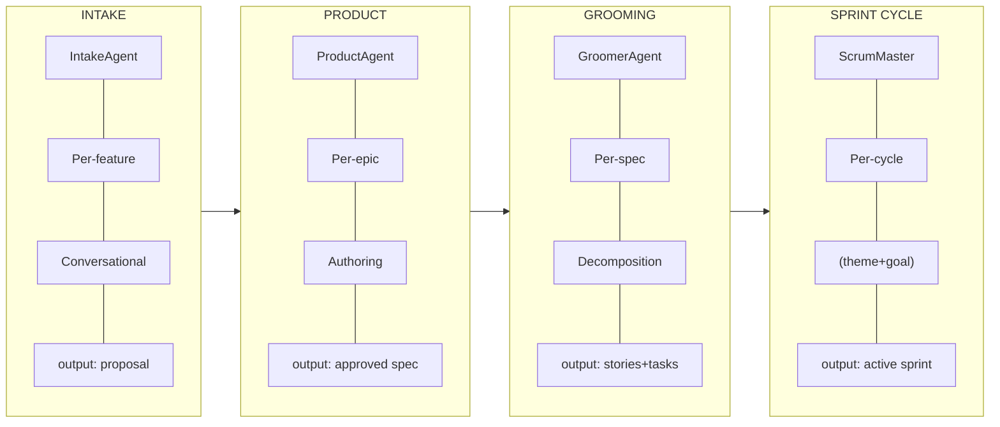
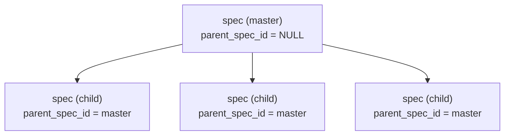
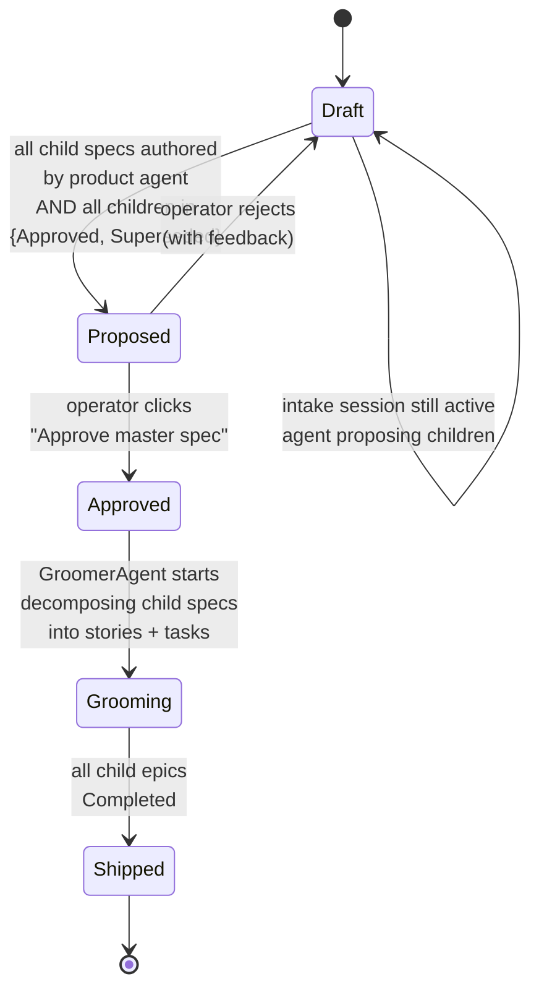
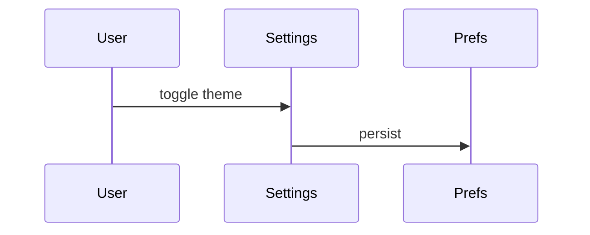
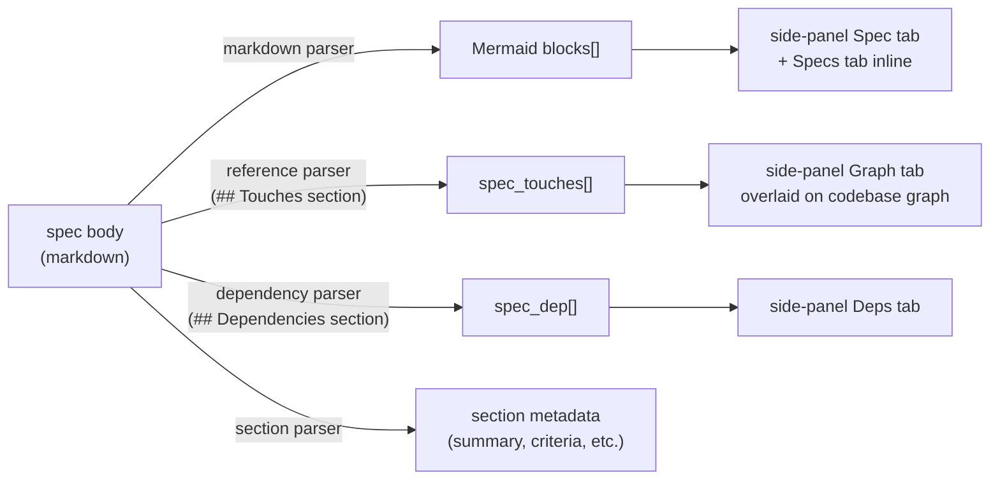
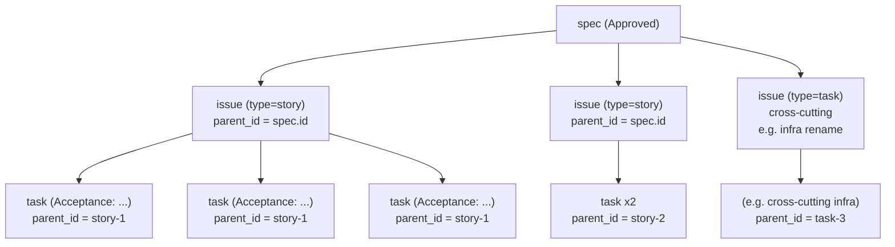
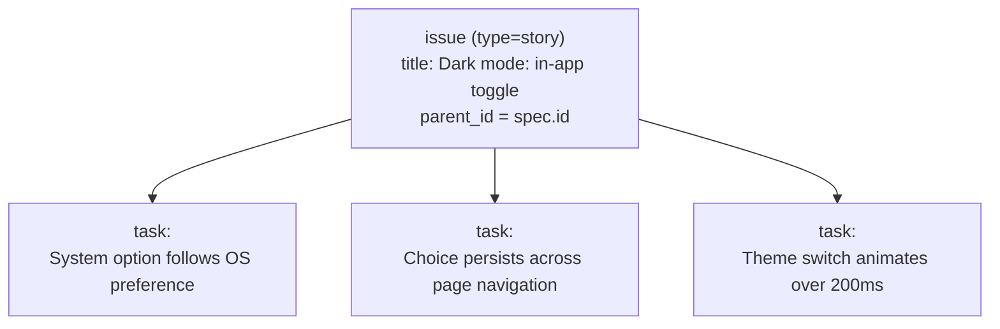
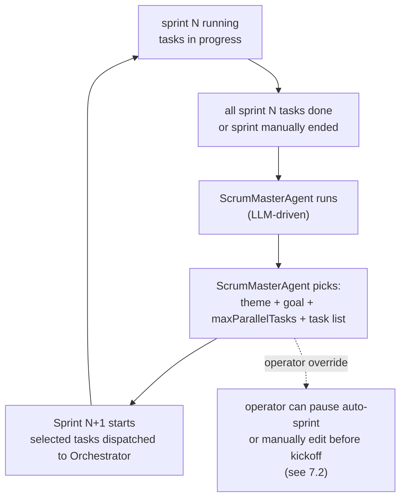
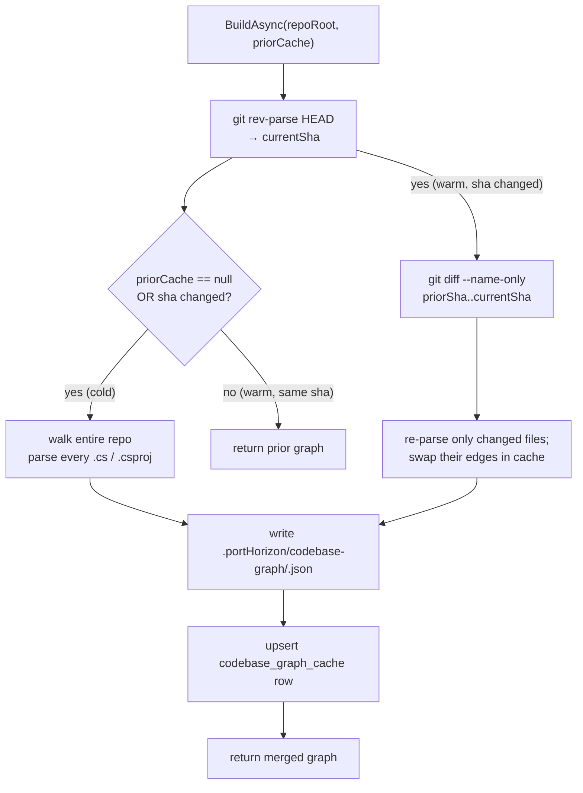

# Intake -> Sprint workflow

> Status: **DRAFT for review, all 12 open questions RESOLVED.**
> Nothing in this document is implemented yet. Sections marked
> `OPEN` need a decision before we build. Sections marked `PROPOSED`
> are my recommendation but yours to overrule.
>
> **Last revision (2026-07-01):** reframed the sprint cycle as
> **operator-hands-off, agent-driven**. ScrumMasterAgent is now an
> LLM agent that runs at sprint-end, picks the next sprint
> autonomously, and kicks off. The deterministic scorer is a
> signal the agent can use, not the picker itself. The "Plan next
> sprint" operator modal is gone — the agent plans. Operator
> observability + an "auto-pause" toggle are the only intervention
> points. All 12 open questions resolved.

Companion to `agent-framework-design.md`, which covers the agent
runtime itself. This document covers **what the agents do together**
from the moment an operator opens a conversation through the moment
the next sprint kicks off.

The companion document closes Phase 0 (MAF scaffolding), Phase 1
(skills, intake, specs), and the kilo removal. This document is the
forward-looking design for **Phases 2-4**: the multi-agent workflow
that turns operator intent into shipped increments.

---

## 1. Scope

**In scope:**
- The end-to-end flow from "operator has an idea" to "the next sprint
  has tasks and is about to start."
- The data model changes needed: master spec / child spec hierarchy,
  approval states, grooming traces, sprint-derivation links.
- The agent roster and their responsibilities.
- The dashboard surfaces that make the flow inspectable and
  steerable.
- Race conditions, idempotency, and human-in-the-loop semantics.

**Out of scope:**
- The MAF runtime itself (see `agent-framework-design.md`).
- The intra-engineering-loop mechanical work (worktree creation,
  commit, push, PR). That's P2.
- Long-term durability and crash recovery (that's P4, DurableTask).
  We assume single-process for Phases 2-3.

**The principle:** the operator (the human) is the **product owner**.
The agents are the **scrum team**. The dashboard is the **PM tool**.
We are building the automation of a small but real product team
where the human owns the *what* and the agents do the *how*.

---

## 2. Actors

| Role | Human/AI | Owns | Example concerns |
|---|---|---|---|
| **Operator** | Human | Product intent. Accepts epics. Approves master specs. Observes sprint outcomes. Stays hands-off post-intake. | "we need to support dark mode", "this epic is too big, split it" |
| **IntakeAgent** | AI (MAF) | Conversational intake of a new feature idea into a structured proposal. | "ask the operator clarifying questions until the spec is unambiguous" |
| **ProductAgent** | AI (MAF) | Once an intake is approved, expand a single epic into a full spec (acceptance criteria, scope, non-goals, open questions). | "here's exactly what success looks like; here's what we're NOT doing" |
| **GroomerAgent** | AI (MAF) | Decompose approved specs into stories + tasks sized for the engineering loop. | "a story is 1-3 tasks; each task has a clear Done" |
| **ScrumMasterAgent** | AI (MAF) | The autonomous sprint cycle. Reads the just-completed sprint, picks the next sprint's theme + goal + maxParallelTasks + task list, kicks off. Operator is hands-off. | "given the just-completed sprint, what should the next sprint be?" |
| **OrchestratorAgent** | AI (existing) | Engineering dispatch. Owns the worktree/commit/push/PR pipeline. | "claim the next Pending task, run CoreDev, open PR" |

The ScrumMasterAgent IS an LLM agent (Phase 3). It uses a
deterministic scoring function as one *signal* among many
(priority, theme-match, age, dependency penalty). The agent's
free-form `Rationale` is the primary explainability artifact
— the score breakdown is the structured component, the
rationale is the prose component. Both land in `sprint_selection`.

For Phase 4, all five agents run inside a DurableTask orchestration
so a single agent crash doesn't lose the operator's work. We do not

For Phase 4, all five agents run inside a DurableTask orchestration
so a single agent crash doesn't lose the operator's work. We do not
solve that here.

---

## 3. The four phases of work

There are four distinct phases that look like a waterfall but actually
cycle:



A single operator session typically produces multiple intake
proposals, which becomes multiple specs, which become multiple
sprints-worth of stories. The phases share state via the database.

---

## 4. Intake session lifecycle

### 4.1 What's an intake session?

Already implemented in P1.4 (`IntakeStore`, schema v3). A session is
a per-project conversation between the operator and the
`IntakeAgent`. The agent has project skills loaded via the
`SqliteSkillSource` (P1), has access to the codebase + in-progress
work via a new `IProjectContextSource` (Phase 2, NEW) and the
codebase's file-level import graph (Phase 2, NEW), and proposes
epics via the `create_epic` AIFunction.

The IntakeAgent is the *author* of the spec bodies, not just an
issue-creator. It writes the spec body in real time as the operator
talks — including **diagrams** (sequence, flowchart, dependency)
rendered in a side-panel next to the chat thread. This is the
key addition for Phase 2 (see section 5 below).

### 4.2 Project context source (NEW, Phase 2)

The intake agent's job in the new world requires "total knowledge of
the codebase + in-progress work." We add a single new abstraction:

```
interface IProjectContextSource
{
    Task<ProjectContext> BuildAsync(string projectId, CancellationToken ct);
}

record ProjectContext(
    string ProjectId,
    string RepoRoot,
    IReadOnlyList<CodeSnippet> CodeSnippets,    // curated: README, key entry points
    IReadOnlyList<IssueRecord> OpenIssues,      // status != Completed AND != Archived
    IReadOnlyList<SpecRecord> RecentSpecs,      // updated within last N days
    IReadOnlyList<SkillRecord> ProjectSkills);
```

**Open / to decide:** how `CodeSnippets` are populated. PROPOSED:
on first intake per project, walk the repo and grab `README.md`,
the top-level `*.sln`, and one representative file per top-level
directory. Cache on disk. Re-walk on demand (operator click
"refresh project context"). We are NOT doing RAG embeddings yet —
this is a hand-curated snapshot, fast and explainable.

### 4.2a Codebase import graph (NEW, Phase 2)

The intake agent also needs the **actual dependency structure** of
the code: which classes touch which, which modules depend on
which, which planned work is downstream of which. We build this
with a new abstraction:

```
interface ICodebaseGraphBuilder
{
    Task<CodebaseGraph> BuildAsync(string repoRoot,
                                   CodebaseGraphCache? priorCache,
                                   CancellationToken ct);

    /// Result carries enough info to diff against the prior cache
    /// and to give the operator a "graph has changed, refresh?"
    /// prompt.
    record CodebaseGraph(
        string RepoRoot,
        DateTime BuiltAt,
        IReadOnlyList<FileNode> Files,
        IReadOnlyList<ImportEdge> Imports,
        IReadOnlyList<ProjectEdge> Projects);

    record FileNode(string Path, string Language, string Module);
    record ImportEdge(string From, string To);
    record ProjectEdge(string FromProject, string ToProject);
}

record CodebaseGraphCache(DateTime BuiltAt, string Hash);
```

**Implementation: `DotnetCodebaseGraphBuilder` for v1.** It parses
`.csproj` ProjectReferences and `using` directives inside `.cs`
files. Modular: a future `TypeScriptCodebaseGraphBuilder` slots in
by implementing the same interface.

**Incremental / differential.** PROPOSED: the builder takes the
prior cache + its content hash. If `git status` is clean against
the prior cache, returns the prior graph unchanged. If files
changed, only re-parses the changed files and emits a diff. The
cache lives at `.portHorizon/codebase-graph/<repo-sha>.json`. We
do not rebuild from scratch unless the operator asks for a
"full re-scan" or the repo hash changes (a fetch + merge).

> **RESOLVED Q9:** granularity. Per-file for the import graph
> (smaller, faster), per-class names in the spec overlay. The
> graph is per-file; the overlay translates as needed.

### 4.3 The chat

The chat is already implemented. The intake agent is told:
- "You are the IntakeAgent for project {projectId}. The codebase,
  open issues, and dependency graph are described below. Help the
  operator refine their idea into a series of structured epics.
  Use `create_epic` when an idea is shaped enough; ask questions
  when it isn't. Use `add_dependency` to declare that an epic
  blocks or depends on another spec. Use embedded Mermaid in the
  spec body to capture domain-level sequence diagrams, flowcharts,
  and dependency graphs — those render live in the side-panel."

The chat session persists in `intake_session` + `intake_message`.
The agent's "memory" of the conversation is the persisted history.

### 4.3a Side-panel visualization (NEW, Phase 2)

The Intake tab gets a layout change: the chat thread moves to the
left (~50% width), a live visualization pane on the right (~50%).
The right pane has three tabs:

- **Spec** — the currently-being-authored spec body, with each
  Mermaid block rendered inline as the agent produces it. This is
  the operator's reading view while the chat scrolls.
- **Graph** — a node-edge view of the current intake's spec tree
  plus the relevant slice of the codebase. Services and modules are
  nodes. Specs are nodes. Spec -> module edges are overlaid on top
  of the codebase edges. Mermaid `flowchart` for the codebase,
  `graph TD` for the spec tree. The operator can pan + zoom + click
  a node to drill in.
- **Deps** — the spec_dep edges declared by the agent via
  `add_dependency` + the auto-detected ones. Bidirectional: blocks
  vs depends_on. Sorted by impact (what's downstream of what).

All three tabs update live as the agent produces output (SSE
streaming; see section 10 race-condition notes). The operator can
click a node in any tab to jump to the underlying spec in the
Specs tab.

### 4.4 Multi-epic proposal

**PROPOSED**: the current `create_epic` AIFunction is enriched. The
intake flow:
1. Operator says "we need to support dark mode."
2. Agent asks clarifying questions (sessions, themes, persistence,
   system preferences vs in-app toggle, etc.).
3. Agent calls `create_epic("Dark mode: settings persistence",
   body="## Summary\n... ## Acceptance criteria\n... ## Diagrams\n"
   + (mermaid block),
   parent_spec_id=null /*master*/, priority=2)`.
4. Agent calls `create_epic("Dark mode: theme variables", ...,
   parent_spec_id=master)`.
5. Agent calls `create_epic("Dark mode: in-app toggle", ...,
   parent_spec_id=master)`.
6. Each call produces a system message in the session linking
   back to the proposed issue id + spec id.

The operator sees three Accept buttons in the chat (one per
proposed epic), plus an "Accept all" affordance. The dashboard
intake tab becomes denser.

The `body` parameter is structured markdown (see section 5.4) so
that the side-panel's Spec and Graph tabs can render properly. The
agent is required to include at least one Mermaid block per child
spec when its scope is non-trivial (sequence diagrams for
flows, flowcharts for state changes, dependency graphs for
service-to-service interactions).

### 4.5 Spec-first vs issue-first for proposal output

**RESOLVED.** The intake agent always emits a spec (master +
children) when proposing a feature. The spec is the source of
truth. The issue is the durable work-tracking artifact derived
from the spec via `spec.parent_issue_id`. Both are created in
the same `create_epic` AIFunction call. See section 5.1.

> **RESOLVED Q1:** spec-first proposal output. Confirmed.

1. Operator says "we need to support dark mode."
2. Agent asks clarifying questions (sessions, themes, persistence,
   system preferences vs in-app toggle, etc.).
3. Agent calls `create_epic("Dark mode: settings persistence",
   "Persist the user's theme choice across sessions and devices",
   priority=2)` for the data layer piece.
4. Agent calls `create_epic("Dark mode: theme variables",
   "Define a token set for surfaces (panel, accent, fg, muted) and
   wire them through the design system", priority=2)` for the
   styling piece.
5. Agent calls `create_epic("Dark mode: in-app toggle",
   "Add an in-app theme switcher with a system-preference follow option",
   priority=3)` for the UI piece.
6. Each call produces a system message in the session linking
   back to the proposed issue id.

The operator sees three Accept buttons in the chat (one per
proposed epic), plus an "Accept all" affordance. The dashboard
intake tab becomes denser.

## 5. Master + child spec authoring

### 5.1 Spec tree



Schema-wise, this is already supported: `spec.parent_spec_id`
exists in v4 (added in P1.5.a). What changes is the **status
contract** of the master.

### 5.2 Master status lifecycle



Master transitions to `Proposed` when:
- All child specs have been visited by the product agent
  (`spec.body IS NOT NULL AND spec.author LIKE 'product:%'`), AND
- All child specs are in `{Approved, Superseded}` (i.e. none is
  still `Draft`).

Master transitions to `Approved` when the operator clicks
"Approve master spec" in the dashboard. There's no path
`Proposed -> Approved` other than the operator clicking the
button.

> **RESOLVED Q2:** Operator approval of the master is required.
> The master is the durable record; the operator is the product
> owner. Friction is acceptable; auto-approve would silently
> skip the last checkpoint.

### 5.3 Child spec authoring (Phase 2-3)

When the operator clicks Accept on a child epic:
1. The linked child spec moves from `Draft` to `Approved`
   (operator is implicitly approving the spec body).
2. The GroomerAgent wakes up (or is queued) for that spec.
3. The ProductAgent also runs once per child to expand the
   accept criteria + scope + non-goals + open questions.
   The IntakeAgent's `create_epic` call already created a
   one-paragraph body for the spec. The ProductAgent rewrites
   that into the structured form (see 5.4 below).
4. Once ProductAgent has authored the child spec, the spec
   moves to status `Draft` (yes, the operator goes Draft ->
   operator-approved-as-part-of-intake -> Draft again as product
   refines it, then Draft -> Approved by operator).

> **RESOLVED Q2.5:** Status churn = (a). Operator Accept approves
> the epic, not the spec. Product refines directly to Draft.
> Single review per spec at the master level.

### 5.4 Spec structure (default + override)

The intake agent and product agent write specs in this shape
(markdown). The IntakeAgent writes the **initial draft** during
conversation (with the operator's clarifications folded in),
then the ProductAgent rewrites into the **fully-structured form**
below once the epic is Accepted.

```
## Summary
One-paragraph restatement of the epic in the operator's own words.

## Acceptance criteria
- [ ] concrete, testable behavior...
- [ ] concrete, testable behavior...

## Diagrams
<!-- one or more Mermaid blocks, rendered live in the Intake tab's
     side-panel "Spec" view and on the Specs tab. Diagram types the
     agent is encouraged to use:
       - sequenceDiagram   for service-to-service flows
       - flowchart         for state machines and decision flows
       - graph LR / TD     for domain-level dependency graphs
       - classDiagram      sparingly, only when OO structure matters
     At least one diagram per non-trivial child spec. -->



## Out of scope
- explicit non-goal...
- explicit non-goal...

## Open questions
- question still to answer?...
- question still to answer?...

## Touches
<!-- declared by the IntakeAgent via the touches() AIFunction and
     auto-extracted from diagrams + spec body. Operator sees a
     list of modules / services this spec affects. Example:
       - PortHorizon.Core.Auth
       - PortHorizon.Dashboard.Theming
     Used to render the side-panel "Graph" tab. -->

## Dependencies
<!-- declared via add_dependency(). Example:
       - blocks: spec-portal-redirect
       - depends_on: spec-auth-claims
     Used to render the side-panel "Deps" tab. -->

## Notes
(optional) technical notes, anything that didn't fit above.
```

The Specs tab renders this with a section-style layout: each
## section in its own card. If a section is missing, it's not
rendered (freeform override). Plain `body` without section headings
is rendered as a single code block, preserving formatting.

Diagrams are extracted from ```mermaid``` blocks via a markdown
parser and stored in a derived `spec_diagram` table (see section
8) so the UI doesn't have to re-parse on every render. When a
spec body is updated, the diagrams are re-extracted.

### 5.5 Body extraction pipeline

On every `create_spec` / `update_spec_body` / `set_status`, we run
an extraction pass:



The extraction is deterministic and cheap; we keep the derived
tables (8.3, 8.4, 8.5) so the UI doesn't re-parse on every load.
The body remains the source of truth; the derived tables get
overwritten by the next extraction. Reconciliation: there is no
write API on the derived tables other than this extraction pass.

### 5.6 Versions

Already implemented in P1.5.a: every spec body update appends a
new `spec_version` and bumps `spec.current_version`. The
Specs tab shows the version history with author + timestamp.

PROPOSED: when the product agent refines a spec, author is
`"product:<run_id>"` so the operator can distinguish their own
edits from agent edits in the version history.

---

## 6. Grooming phase

Once a child spec is `Approved`, the GroomerAgent runs.

### 6.1 Goals

- Decompose the spec into 1-3 stories.
- Each story becomes 1-3 engineering tasks.
- Tasks are sized so the engineering loop (worktree, edit, test,
  commit, push, PR) can complete in a single CoreDev/ClientDev
  agent run (P0 showed the agent can do this — the no-op commit
  branch in P0 means "agent ran but didn't edit any files," not
  a failure).
- Acceptance criteria from the spec become task titles or
  descriptions.

### 6.2 Output



Each story has `parent_id = spec.id`. Each task has `parent_id =
story.id`. Issues already have a `parent_id` column (added in
the design back in P0). The hierarchy is `spec -> story -> task`
via `parent_id`.

### 6.3 Story/task metadata

Issue `type` is enriched:
- `type = "story"` for stories.
- `type = "task"` for tasks (default).
- `type = "epic"` stays as the issue-level epic from intake.
- `type = "spec"` is reserved for cross-references but the spec
  itself lives in the spec table, not the issue table.

### 6.4 Acceptance criteria mapping

The spec's `## Acceptance criteria` checkboxes become the task
titles in the order they appear. Example:

> Spec: "Dark mode: in-app toggle"
>
> Acceptance criteria:
> - "System" option follows OS preference
> - Choice persists across page navigation
> - Theme switch animates over 200ms

Becomes:



> **RESOLVED Q3:** Multiple stories, 1 task per criterion. If a
> spec has 12 acceptance criteria, split into N stories of ≤3
> criteria each. Each story has 1 task per criterion. Stories
> preserve the "epic-size" unit; tasks are 1:1 with criteria.

### 6.5 GroomingAgent prompt shape

```
You are the GroomerAgent for project {projectId}. Given the
following Approved spec, decompose it into 1-3 stories of 1-3
tasks each. Each task must be completable in a single
engineering agent run.

Spec:
{body}

Available tools:
- create_story(title, parent_spec_id, acceptance_criteria):
  creates a story issue linked to the spec. Returns the
  story issue id.
- create_task(title, parent_story_id, parent_spec_id): creates
  a task linked to the story. Returns the task issue id.

After creating the stories and tasks, call set_spec_status(
spec_id, "Grooming") to mark the spec as decomposed. The
system will move it to Shipped when all of its tasks are
Completed.
```

This is a one-shot agent run. The agent decides the decomposition.
No iterative back-and-forth (the operator can intervene manually
in the Tasks tab if the decomposition is wrong).

---

## 7. Sprint cycle (the scrum loop)

This is the part that is least defined. I have a proposal, you have
opinions, let's make sure we agree before coding.

### 7.1 The cycle (operator hands-off, agent-driven)

After intake, the operator is hands-off. Sprints build themselves.
A "sprint" already exists in the data model as `sprint` +
`sprint_issue` (P0). What is NEW in Phase 3 is the **agent-driven
selection ritual** that runs at sprint end.



The operator's main interaction post-intake is **observability**:
the Sprints tab shows what just finished, what was picked for
next, and why. Intervention is via a per-sprint toggle:

- **Auto-pause**: stop the agent from kicking off the picked
  sprint; operator reviews before start.
- **Manual edit**: drag-and-drop the picked tasks before kickoff.
- **Force kickoff**: skip review entirely (the default).

These interventions exist but are not the happy path. The
happy path is fully autonomous.

### 7.2 Sprint selection (the scrum loop)

The ScrumMasterAgent runs at sprint-end with this context:

- The just-completed sprint: `sprint`, all its `sprint_issue`
  rows, each task's final status (Completed / Failed /
  Cancelled), and the agent's final `lastResponse` for each
  task.
- The current full backlog: pending tasks grouped by parent
  spec, ordered by priority + age.
- Recent specs: the last N (default 10) spec updates.
- Operator-set global policy: `ScrumMasterOptions` from
  `appsettings.json`:
  - `DefaultMaxParallelTasks` (default 4)
  - `DefaultSprintLengthDays` (default 14)
  - `MaxThemeSwitchCount` (default 2) — how many consecutive
    sprints on the same theme before forcing a pivot
  - `MinTasksPerSprint` (default 1) — don't kick off a sprint
    with fewer tasks; sprint ends and waits.

The agent has four tools:

```
class ScrumMasterAgent
{
    [Tool] IReadOnlyList<IssueRecord> QueryBacklog(
        IssueStatus status = Pending,
        int? parentSpecId = null,
        int? priorityMax = null,
        int limit = 100);

    [Tool] SpecRecord GetSpec(string specId);

    [Tool] SprintRecord GetJustCompletedSprint();

    [Tool] void PickSprint(PickSprintSpec pick);
}

record PickSprintSpec(
    string Theme,
    string Goal,
    int MaxParallelTasks,
    int SprintLengthDays,
    string[] TaskIds,
    string Rationale);    // free-form: why these tasks?
```

The agent's prompt instructs it to:

1. Look at the just-completed sprint. What themes were in flight?
   What worked? What failed?
2. Decide: continue the same theme (carry momentum) or pivot
   to fresh work (avoid stalling on a stuck area).
3. Honor `MaxThemeSwitchCount` — if the last N sprints were on
   theme X, force a pivot.
4. Score tasks mentally using the rules below as one signal.
   The agent is free to overrule.
5. Pick up to `DefaultMaxParallelTasks` tasks. If fewer are
   available, pick fewer — `MinTasksPerSprint` is the floor.
6. Commit the pick via `PickSprintSpec` with a rationale.

> **RESOLVED Q4 (formerly "rules vs LLM"):** LLM-driven in P3.
> The deterministic scoring is provided as a TOOL the agent can
> call, not the picker itself. Rule-based scoring lives on for
> the agent to use as a signal; agent's free-form `Rationale`
> becomes the breakdown field in `sprint_selection`.

**Scoring formula (the agent's signal, not its decision):**

```
score(task) =
    + 10 if task.priority == 1 (highest)
    + 6  if task.priority == 2
    + 3  if task.priority == 3
    + 2  if task.priority == 4
    + 1  if task.priority == 5
    + 5  if task's parent story is linked to a spec with
          matching theme substring in title or body
    + 2  per day of age (capped at +10)
    - 20 if a downstream task is already in another sprint
    +0  otherwise
```

The agent's `PickSprintSpec.Rationale` field is the
explainability story. The score breakdown (each `+N component`)
goes into `sprint_selection.score_breakdown` alongside the
agent's prose rationale. Operator reads both in the dashboard:
"Why this task? score: +10 priority=1, +5 theme match.
Rationale: continuing the auth rework because sprint 5's two
auth tasks both failed retry-able."

### 7.3 Sprint kick-off

When the ScrumMasterAgent's `PickSprintSpec` is committed:

1. Insert `sprint` row: `status = "active"`, `start_date = now`,
   `end_date = now + sprint_length_days`.
2. For each picked task: insert `sprint_issue` row with
   `score_breakdown` populated.
3. For each task: dispatch to `OrchestratorAgent` (the existing
   claim → run → worktree pipeline). The orchestrator dispatches
   in parallel up to `sprint.max_parallel_tasks`.
4. Dashboard moves tasks to `InProgress` as they're claimed.

### 7.4 Sprint end

When all the sprint's tasks are Completed (or the operator
manually ends the sprint, or `MinTasksPerSprint` was hit):

1. Sprint moves to `status = "completed"`.
2. The Specs tab moves all `Grooming` specs whose tasks are
   now done to `Shipped`.
3. Trigger ScrumMasterAgent run for the next sprint.
4. Loop forever (or until operator pauses auto-sprint).

> **RESOLVED Q5 (formerly "backlog < N cards"):** The agent
> picks `maxParallelTasks` per its own judgment. The
> `MinTasksPerSprint` floor means a sprint won't kick off with
> fewer than 1 task; if the backlog is empty, the system waits.
> No modal-confirmation UX is needed.

> **RESOLVED Q7 (formerly "Sprint Planning state"):** The
> `Planning` state is internal to the ScrumMasterAgent run.
> Operator doesn't see it as a UI state — they see the picked
> sprint appear in the dashboard with theme + goal + tasks
> listed, briefly tagged as "proposed" before auto-start. The
> auto-pause toggle (§7.1) is the operator's intervention
> point.

---

## 8. Data model additions

What we need to add or change to support the above:

### 8.1 Issues (existing table, additive)

| Column | Type | Default | Purpose |
|---|---|---|---|
| `parent_id` (already exists) | TEXT NULL | NULL | Generic parent. Used for spec->story->task chain. |
| `acceptance_criteria_index` | INTEGER NULL | NULL | Order within parent spec; populated by GroomerAgent. |

> The chain `spec -> story -> task` is `parent_id` only. We do
> not need new columns for the chain itself.

### 8.2 Specs (schema v5, additive)

Schema v5 adds:

| Column | Type | Default | Purpose |
|---|---|---|---|
| `extracted_at` | TEXT NULL | NULL | Timestamp of the last body extraction. NULL = not yet extracted. |

We do NOT add other columns. `parent_spec_id`, `current_version`,
`status`, `body`, `author` cover everything else. Diagrams,
touches, and deps live in derived tables below — the body remains
the source of truth.

### 8.3 New table: spec_diagram (derived from body)

Each Mermaid block in the spec body becomes a row. The UI uses
this instead of re-parsing the body on every render.

```sql
CREATE TABLE spec_diagram (
    spec_id   TEXT NOT NULL REFERENCES spec(id) ON DELETE CASCADE,
    ordinal   INTEGER NOT NULL,    -- 0-based order in the body
    kind      TEXT NOT NULL,        -- 'sequenceDiagram'|'flowchart'|'graph'|'classDiagram'|'other'
    source    TEXT NOT NULL,        -- raw Mermaid source
    title     TEXT,                 -- optional ## heading above the block
    PRIMARY KEY (spec_id, ordinal)
);
```

Repopulated on every body update by the extraction pipeline
(section 5.5). No manual edits.

### 8.4 New table: spec_touches (declared + auto-extracted)

Modules or services that this spec affects. Two sources:

- **Declared:** the IntakeAgent calls `touches(module_id,
  rationale)` during the chat.
- **Auto-extracted:** the extraction pipeline parses the spec
  body (the `## Touches` section + any module mentions in
  Diagrams or Notes).

```sql
CREATE TABLE spec_touches (
    spec_id      TEXT NOT NULL REFERENCES spec(id) ON DELETE CASCADE,
    module_id    TEXT NOT NULL,         -- e.g. 'PortHorizon.Core.Auth'
    source       TEXT NOT NULL,         -- 'declared' | 'auto'
    rationale    TEXT,                  -- the agent's one-line justification
    created_at   TEXT NOT NULL,
    PRIMARY KEY (spec_id, module_id, source)
);
CREATE INDEX ix_spec_touches_module ON spec_touches(module_id);
```

Used by the side-panel Graph tab to overlay spec-affected
modules on top of the codebase import graph. PROPOSED UI:
hovering a module in the graph highlights every spec that
touches it.

### 8.5 New table: spec_dep (declared by agent)

Edges between specs. Bidirectional in the data model so the UI
can render "what depends on me?" without joining:

```sql
CREATE TABLE spec_dep (
    from_spec_id   TEXT NOT NULL REFERENCES spec(id) ON DELETE CASCADE,
    to_spec_id     TEXT NOT NULL REFERENCES spec(id) ON DELETE CASCADE,
    kind           TEXT NOT NULL,    -- 'blocks' | 'depends_on' | 'related'
    rationale      TEXT,
    source         TEXT NOT NULL,    -- 'declared' | 'auto'
    created_at     TEXT NOT NULL,
    PRIMARY KEY (from_spec_id, to_spec_id, kind)
);
CREATE INDEX ix_spec_dep_to ON spec_dep(to_spec_id);
```

`blocks`: source must complete before target can start.
`depends_on`: source waits for target. `related`: informational,
no ordering implication.

PROPOSED: `add_dependency(from, to, kind, rationale)` AIFunction
is the single way these rows are created. The extraction
pipeline does NOT auto-create spec_dep rows from prose; the agent
must declare them explicitly. (Auto-detection of spec-to-spec
deps from the codebase is a Phase 4 ask.)

### 8.6 New table: codebase_graph_cache (incremental)

The import graph from §4.2a is cached on disk, with a small
SQLite index to speed up lookup:

```sql
CREATE TABLE codebase_graph_cache (
    repo_sha    TEXT PRIMARY KEY,
    built_at    TEXT NOT NULL,
    file_count  INTEGER NOT NULL,
    edge_count  INTEGER NOT NULL
);
```

The actual graph files live in
`.portHorizon/codebase-graph/<repo-sha>.json` on disk; the SQLite
entry is just a manifest. The incremental builder consults
`git rev-parse HEAD` to determine the current sha, and
`git diff <prior-sha>..HEAD --name-only` to know which files
changed.

### 8.7 New table: sprint_selection

A new table to record the scrum-loop audit trail. Why this needs
to be its own table: the user wants to see "why was this task
included?" in the dashboard, and the answer depends on the
scoring context at sprint-plan time (which tasks existed, which
were in other sprints, etc.) — we can't reconstruct it from the
`sprint_issue` table alone.

```sql
CREATE TABLE sprint_selection (
    sprint_id        TEXT NOT NULL,
    task_id          TEXT NOT NULL,
    included         INTEGER NOT NULL,    -- 1 or 0
    score            INTEGER NOT NULL,
    score_breakdown  TEXT NOT NULL,       -- JSON: ["+10 priority=1", "+5 theme match", ...]
    operator_override INTEGER NOT NULL,    -- 1 if operator flipped the default
    created_at       TEXT NOT NULL,
    PRIMARY KEY (sprint_id, task_id)
);
```

> PROPOSED. The score_breakdown makes the explainability trivial
> and gives the operator a paper trail of decisions. If you don't
> care about this, we can derive it later from a log.

### 8.8 New table: intake_session_master

To make the "intake produces a master spec" link clean. Each
intake session optionally owns one master spec (or none if the
intake ended without proposing anything).

```sql
ALTER TABLE intake_session ADD COLUMN master_spec_id TEXT;
ALTER TABLE intake_session ADD COLUMN master_spec_id REFERENCES spec(id);
```

Alternatively, store this as metadata on the spec: `spec.author
= "intake:<session_id>"`. PROPOSED: use metadata (matches existing
conventions; no new schema change needed).

### 8.9 Sprint status

PROPOSED: add `status = "Planning"` to the sprint lifecycle:
`Planning -> Active -> Completed`. The current schema has
`Active` already; Planning is new.

`Planning` means: tasks selected, sprint not started yet. Lets
the operator see a half-built sprint in the Sprints tab and
adjust before clicking Start.

---

## 9. New abstractions (Phase 2 / Phase 3)

### 9.1 IProjectContextSource (Phase 2)

```
namespace Forge.Agents;

public interface IProjectContextSource
{
    Task<ProjectContext> BuildAsync(string projectId, CancellationToken ct);
}

public sealed record ProjectContext(
    string ProjectId,
    string RepoRoot,
    IReadOnlyList<CodeSnippet> CodeSnippets,
    IReadOnlyList<IssueRecord> OpenIssues,
    IReadOnlyList<SpecRecord> RecentSpecs,
    IReadOnlyList<SkillRecord> ProjectSkills);
```

Implementation: `FilesystemProjectContextSource`:
1. Walk the `WorkspaceOptions.Root` directory.
2. Snapshot `README.md`, top-level `*.sln`, `*.csproj`,
   one representative `.cs` per top-level subdir.
3. Read `AgentStore`, `IssueStore` (Pending + InProgress),
   `SpecStore` (recent, by `updated_at`).
4. Read `SkillStore`.

Caching: write the snapshot to `.portHorizon/context/<project>.json`
on first build; refresh on demand.

### 9.2 ProductAgent + GroomerAgent (Phase 2)

Two new agent classes, each a `ChatClientAgent` (the MAF
abstraction) with its own tool set. Both extend the same base:

```
abstract class SpecLifecycleAgent
{
    protected ChatClientAgent NewAgent(AgentType role, string sessionId, AIFunction[] tools);
}

sealed class ProductAgent : SpecLifecycleAgent
{
    // tools: propose_spec, propose_epic, update_spec
    Task<SpecRecord> AuthorChildSpec(string specId, CancellationToken ct);
}

sealed class GroomerAgent : SpecLifecycleAgent
{
    // tools: create_story, create_task, set_spec_status
    Task GroomAsync(string specId, CancellationToken ct);
}
```

### 9.3 ScrumMasterAgent (Phase 3, LLM-driven)

The ScrumMasterAgent is an LLM agent that runs at sprint-end and
picks the next sprint autonomously. It is built on the same
ChatClientAgent abstraction as the IntakeAgent / ProductAgent /
GroomerAgent.

```
namespace Forge.Agents;

public sealed class ScrumMasterAgent
{
    public ScrumMasterAgent(
        IChatClientFactory chatClientFactory,
        LlmConfig config,
        ISprintStore sprints,
        IIssueStore issues,
        ISpecStore specs,
        AgentMessageBus messageBus,
        IDashboardEventBus events,
        ISkillSource? skills,
        ILogger<ScrumMasterAgent> logger,
        string kiloAgentsRoot = ".kilo/agents");

    /// <summary>
    /// Run the scrum loop: read the just-completed sprint, pick
    /// the next sprint's task list, commit via PickSprintSpec.
    /// </summary>
    public async Task<SprintRecord?> RunAsync(
        string completedSprintId,
        CancellationToken ct);
}
```

The agent's tool set (registered as AIFunctions on the
ChatClientAgent) includes:

- `QueryBacklog(status, parentSpecId?, priorityMax?, limit)`:
  paginated read of pending tasks.
- `GetSpec(specId)`: pull a spec body + version metadata.
- `GetJustCompletedSprint()`: sprint + tasks + outcomes.
- `GetGlobalPolicy()`: read `ScrumMasterOptions` from config.
- `PickSprint(PickSprintSpec)`: commit the pick. Writes
  `sprint` + `sprint_issue` + `sprint_selection` rows atomically.

The `ScrumMasterOptions` config:

```json
{
  "scrumMaster": {
    "defaultMaxParallelTasks": 4,
    "defaultSprintLengthDays": 14,
    "maxThemeSwitchCount": 2,
    "minTasksPerSprint": 1
  }
}
```

A `DeterministicScorer` class is still implemented (used by the
agent as a *signal*, not a decision). It returns the same
`+10 priority / +5 theme match / -20 dep penalty` breakdown
described in §7.2. The agent reads the scored list and applies
its own judgment on top.

### 9.4 Dashboard additions

- **Specs tab** (P1.5.a, done): read-only list + detail.
- **Specs tab** (P2): add "Approve master" + "Start grooming"
  buttons (operator actions). Also show `parent_spec_id` as a
  breadcrumb. Render Mermaid blocks in the detail view.
- **Tasks tab**: show spec/story chain on hover; show
  `parent_id` chain in the row tooltip.
- **Sprints tab** (P3): show just-completed sprint's outcome +
  ScrumMasterAgent's picked next-sprint. Two cards: "Last sprint"
  (closed) and "Next sprint" (just-picked, dispatching). Per-task
  tooltip shows score + agent's rationale. Per-sprint toggle:
  "auto-pause next sprint" (operator override).
- **Intake tab** refinement (P2): SSE streaming output so the
  operator sees tokens land as the agent produces them; per-message
  Accept for child epics; "Accept all proposed epics" button.
- **Intake tab** side-panel (P2, NEW): three tabs (Spec, Graph,
  Deps) described in §4.3a. Renders Mermaid blocks live; the Graph
  tab overlays `spec_touches` on top of the codebase import graph;
  the Deps tab shows `spec_dep` edges. Pan + zoom + click-to-drill
  is in scope; the Mermaid library provides this for free, we just
  need to embed it.

### 9.5 ICodebaseGraphBuilder (Phase 2, NEW)

The incremental graph builder. See §4.2a for the interface:

```
namespace Forge.Codebase;

public interface ICodebaseGraphBuilder
{
    Task<CodebaseGraph> BuildAsync(
        string repoRoot,
        CodebaseGraphCache? priorCache,
        CancellationToken ct);

    bool SupportsLanguage(string language);
}

public sealed record CodebaseGraph(
    string RepoRoot,
    DateTime BuiltAt,
    string RepoSha,                   // git rev-parse HEAD
    IReadOnlyList<FileNode> Files,
    IReadOnlyList<ImportEdge> Imports,
    IReadOnlyList<ProjectEdge> Projects);

public sealed record FileNode(string Path, string Language, string Module);
public sealed record ImportEdge(string From, string To);
public sealed record ProjectEdge(string FromProject, string ToProject);

public sealed record CodebaseGraphCache(
    DateTime BuiltAt,
    string RepoSha,
    int FileCount,
    int EdgeCount,
    string DiskPath);                 // .portHorizon/codebase-graph/<sha>.json
```

**Implementation: `DotnetCodebaseGraphBuilder`** for v1.
Parses `.csproj` ProjectReferences and `using` directives inside
`.cs` files. Lives behind the interface so we can swap in
`TypeScriptCodebaseGraphBuilder` later without changing callers.

**Incremental behavior:**



1. Compute `git rev-parse HEAD` -> `currentSha`.
2. If `priorCache == null` (cold) **OR** `currentSha != priorSha`
   (warm but changed): go to step 3 or 4 respectively.
3. Cold: walk entire repo, parse every `.cs` / `.csproj`.
4. Warm: `git diff --name-only <prior>..HEAD` -> changed files.
   Re-parse just those; swap their edges in the cached graph.
5. Write new `.portHorizon/codebase-graph/<currentSha>.json`.
6. Update `codebase_graph_cache` row.
7. Return the merged graph.

If `priorCache == null`, the very first build also walks the
whole tree and stores under a `.full-initial.json` slot, then
seeds `codebase_graph_cache` with the current HEAD sha.

### 9.6 SpecBodyExtractor (Phase 2, NEW)

Pure-function pipeline that produces the derived tables
(`spec_diagram`, `spec_touches`, `spec_dep`) from the spec body.

```
namespace Forge.Specs;

public sealed class SpecBodyExtractor
{
    public SpecExtraction Extract(string body);

    // Hand-written markdown subset parser. NOT a general markdown
    // lib — we only handle the ## sections we care about + the
    // ```mermaid``` blocks. Intentional: we want the body to remain
    // portable markdown, not the C# extractor dictating body shape.
}

public sealed record SpecExtraction(
    IReadOnlyList<MermaidBlock> Diagrams,
    IReadOnlyList<string> Touches,        // module ids declared in ## Touches
    IReadOnlyList<SpecDepEdge> Deps);     // declared in ## Dependencies section

public sealed record MermaidBlock(int Ordinal, string Kind, string Source, string? Title);
public sealed record SpecDepEdge(string ToSpecId, string Kind, string? Rationale);
```

The extractor is called by `SpecStore.UpdateBodyAsync` (inserts
into the derived tables inside the same transaction). The body
itself is not modified by the extractor.

---

## 10. Race conditions, idempotency, rollback

Things that can go wrong, and what we do:

### 10.1 Operator closes browser mid-intake

The intake session + message history is in SQLite, durable. On
reopen, the next message resumes the conversation with the
existing history. The side-panel's Spec/Graph/Deps tabs read
from `GET /api/specs/{id}` + `GET /api/specs/{id}/versions` +
`GET /api/sessions/{id}/extract` (extraction cache) on tab open.

### 10.2 Intake agent crash mid-proposal

A `create_epic` call either succeeds (issue row written) or
fails (no row). The session messages are persisted before the
LLM call (P1.4 pattern). If the LLM call throws, the session is
left in a recoverable state — operator can resend.

### 10.3 Operator clicks Accept on a child epic twice

The Accept endpoint is idempotent: it's an `insert or ignore` on
the `sprint_issue` table (existing behavior of SprintStore). The
dashboard hides the Accept button after first click.

### 10.4 Product agent writes a spec while operator edits it

Last-writer-wins. We do not currently implement optimistic
locking on specs. If this becomes a problem we add an
`updated_at` precondition on PATCH; for P2 PROPOSED to skip it.

### 10.5 Operator changes a task's spec link after grooming

PROPOSED: `parent_id` is set during grooming and never edited
after. If the operator wants to re-link, they manually create a
new task. We do NOT support task -> spec re-linking in P2-3.

### 10.6 Sprint ends with some tasks still Pending

PROPOSED: the sprint's `end_date` triggers a "sprint ended" event
in the dashboard. The operator decides:
- "Move incomplete tasks to next sprint" (re-score).
- "Mark incomplete tasks as Failed" (cancel).
- "Extend the sprint by N days" (rare).

We surface this as a Sprints-tab banner; we don't take an
automatic action.

### 10.7 SSE streaming of agent output

PROPOSED: the side-panel updates live as the agent produces
output. The contract:
- Server pushes `intake.run.delta` events with a stream token
  + the partial body (already updated).
- Client's Spec tab re-fetches `GET /api/specs/{id}` on each delta
  event (debounced ~250ms to avoid thrash).
- The Graph + Deps tabs re-fetch on delta too, but only if the
  extraction cache is older than the delta.

If the SSE connection drops, the next render is a full refetch
from `/api/specs/{id}` (no streaming). Lossy on slow networks is
acceptable for v1.

### 10.8 Operator edits spec body directly while intake is active

Operator edits via the Specs tab (`PATCH op=update_body`) while
the IntakeAgent is mid-conversation. Two races:
- Agent's next `add_dependency` call references a spec id the
  operator just deleted. We resolve by checking existence and
  silently dropping the call.
- Agent's body is a fresh draft; operator's body is a refined
  version. The merge strategy is operator-wins: a fresh agent
  call appends a new `spec_version`; the operator's edits remain
  the current version until the next agent call bumps it.

---

## 11. What we ship in each phase

### Phase 2 (next)
The A++ expansion adds the visualization + extraction pipeline
work that wasn't in the original Phase 2 plan. Phase 2 splits
into 2a (foundation) and 2b (UI).

**Phase 2a (foundation):**
- Schema v5: `spec_diagram`, `spec_touches`, `spec_dep`,
  `codebase_graph_cache` tables + `extracted_at` on `spec`.
- `SpecBodyExtractor` (hand-written markdown subset parser).
- `SpecStore.ExtractAndPersistAsync` extension point.
- `ICodebaseGraphBuilder` interface + `DotnetCodebaseGraphBuilder`
  (incremental via `git rev-parse HEAD` + `git diff`).
- `touches` and `add_dependency` AIFunctions.
- Tests for the above (unit tests on the extractor, integration
  test on the graph builder using a fixture repo).

**Phase 2b (UI):**
- Intake tab side-panel: three tabs (Spec, Graph, Deps).
- Mermaid renderer in the Spec tab (already supported by browser;
  we just embed it).
- Codebase graph rendered via Mermaid `flowchart` with `spec_touches`
  as overlaid edges; the Deps tab uses `graph LR` with red/blue
  edges for blocks/depends_on.
- SSE streaming of agent output (delta events). Re-fetch Specs tab
  on each delta (debounced 250ms).
- Refined `create_epic` flow that produces a child spec alongside
  the issue, with structured body (sections + Mermaid).
- Master-spec gating logic: "Proposed when all children authored
  + Approved-or-Superseded."

**Phase 2c (product refinement):**
- `ProductAgent` with `update_spec` tool.
- On operator Accept of a child epic, queue the ProductAgent run.
- Runs in the background (not in the intake chat response cycle).
- Writes the fully-structured spec body (replaces intake draft).

Tests for all of the above.

### Phase 3
- `GroomerAgent` with `create_story` / `create_task` tools.
- `ScrumMasterAgent` (LLM-driven; ChatClientAgent with
  `QueryBacklog`/`GetSpec`/`GetJustCompletedSprint`/`PickSprint`
  tools). Runs at sprint-end, fully autonomous (operator is
  hands-off post-intake).
- `DeterministicScorer` class — used by ScrumMasterAgent as one
  signal among many, not as the picker itself.
- `ScrumMasterOptions` config (defaultMaxParallelTasks,
  defaultSprintLengthDays, maxThemeSwitchCount, minTasksPerSprint).
- Sprints tab redesign: "Last sprint" + "Next sprint" cards
  with per-task score breakdown + agent rationale.
- "Auto-pause next sprint" toggle (operator override).
- `sprint_selection` audit table (already specced in §8.7).
- `pick_sprint` event emitted to the dashboard event bus so the
  Sprints tab updates live.
- Tests: ScrumMasterAgent with scripted chat client returning a
  canned `PickSprintSpec`; sprint-end → next-sprint cycle test
  using real IssueStore + SprintStore + scripted agent.

### Phase 4
- DurableTask for crash recovery.
- Multi-process scaling (probably not — single process is the
  contract).
- Engine handoff (P3.5 in the original design doc) becomes "inbox"
  of pre-groomed stories a developer can pull.

---

## 12. Open questions (must answer before code)

All 12 questions are RESOLVED as of 2026-07-01. The agent-driven
sprint cycle is the late-breaking addition; see the operator-hands-off
reframing in §7.

**Q1 (4.5):** Spec-first vs issue-first proposal output.
**RESOLVED: spec-first.**

**Q2 (5.2):** Operator approval of master required, or auto-approve?
**RESOLVED: required.**

**Q2.5 (5.3):** Status churn during product refinement.
**RESOLVED: (a) — operator Accept only approves the epic, not the
spec; product refines directly to Draft.**

**Q3 (6.4):** How to split >3 acceptance criteria.
**RESOLVED: multiple stories, 1 task per criterion.**

**Q4 (7.2):** Deterministic scorer sufficient, or LLM-driven?
**RESOLVED: LLM-driven in P3.** The agent IS the scorer. The
deterministic scoring function becomes a TOOL the agent can call,
not the picker itself.

**Q5 (7.2):** Backlog smaller than N cards.
**RESOLVED: N/A in new model.** Operator picks theme + maxParallelTasks
during sprint planning; ScrumMasterAgent picks up to that cap.
If fewer are available, the sprint starts smaller; if zero,
the system waits.

**Q6 (8.7):** Per-task sprint score breakdown as a separate table?
**RESOLVED: yes.** `sprint_selection.score_breakdown` carries
structured score components; `PickSprintSpec.Rationale` carries
the agent's free-form reasoning. Both land in the same row.

**Q7 (8.9):** Sprint `Planning` state before `Active`?
**RESOLVED: internal-only.** The `Planning` state is internal to
the ScrumMasterAgent run. Operator doesn't see a "Planning" UI
state — they see the picked sprint appear briefly tagged as
"proposed" before auto-start.

**Q8 (10.4):** Optimistic locking on spec edits?
**RESOLVED: skip for P2, add if it actually becomes a problem.**

**Q9 (4.2a):** Per-file or per-class graph granularity?
**RESOLVED: per-file for the import graph (smaller, faster),
per-class names in the spec overlay.**

**Q10 (4.3a):** Side-panel layout — split 50/50 or 60/40?
**RESOLVED: 50/50 default, resizable later.**

**Q11 (4.4):** Required Mermaid per child spec, or recommended?
**RESOLVED: soft prompt in P2, hard taxonomy deferred.**

**Q12 (8.5):** Auto-detect spec_dep from prose?
**RESOLVED: NO in P2 (causes spurious edges); YES with operator
confirm in P4 once we have a spec-relationship model.**

---

## 13. What this document does NOT decide

For follow-up docs as we build:
- **Theme taxonomy / tagging**: even with the deterministic
  scorer, we may want to tag issues with a theme (e.g.
  "auth", "ui", "infra") for analytics. Defer until we have
  data.
- **Multi-project** intake: should a single operator session
  span multiple projects? Today: no. Defer.
- **Agent memory across runs**: the IntakeAgent's context is
  reconstructed from the session history + project context on
  each run. There is no agent-to-agent memory. Phase 4 ask.
- **Evaluation harness**: how do we know the IntakeAgent /
  ProductAgent wrote a good spec? Do we unit-test with mock
  LLMs (like we do today) or do we eventually need a few real
  LLM evals with the operator scoring them? Defer.
- **Real-time multi-user collaboration on intake**: today the
  intake session is single-operator. Phase 4 ask.
- **Auto-detect new modules/services from intake text**:
  the IntakeAgent might say "we'll add a NotificationsService"
  that doesn't exist yet. Today we don't track this. Phase 4
  ask — likely the scope is "tell me what new components this
  epic creates" as a new AIFunction.
